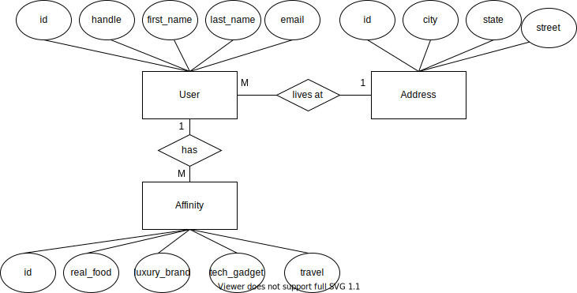

# Assignment 1

1. Total number of users of the social network

```
=COUNT(A:A)
```

2. Number of users in each of the states in the Pacific sub-region, which includes Alaska, California, Hawaii, Oregon and Washington.

```
=COUNTIF(H:H, N5)
=COUNTIF(H:H, N6)
=COUNTIF(H:H, N7)
=COUNTIF(H:H, N8)
=COUNTIF(H:H, N9)
```

3. Number of users in each of the given 5 cities of the USA: Nashville, Tennessee; San Diego, California; New York City, New York; Dallas, Texas; and Seattle, Washington.

```
=COUNTIFS(H:H,O13,G:G,N13)
=COUNTIFS(H:H,O14,G:G,N14)
=COUNTIFS(H:H,O15,G:G,N15)
=COUNTIFS(H:H,O16,G:G,N16)
=COUNTIFS(H:H,O17,G:G,N17)
```

4. The average affinity category IDs of all users in New York for each of the content types.

```
=AVERAGEIF(H:H, O20, I:I)
=AVERAGEIF(H:H, O21, I:I)
=AVERAGEIF(H:H, O22, I:I)
=AVERAGEIF(H:H, O23, I:I)
```

### SQL queries

This section shows the SQL queries that you determined solved each of the given problems.

- abide by [the instructions](./instructions/instructions.md#entering-respones-into-the-readme-file) for how to enter responses into this file correctly.
- **Make sure that all SQL commands you enter into this document work exactly as written, including semi-colons, where necessary.**

1. Write two SQL commands to create two tables named `users` and `affinity_categories` within the given database file.

```sql
CREATE TABLE users (
    id INTEGER PRIMARY KEY,
    handle TEXT,
    first_name TEXT,
    last_name TEXT,
    email TEXT,
    street TEXT,
    city TEXT,
    state TEXT,
    state_animal TEXT,
    real_food_affinity_category_id INTEGER,
    luxury_brand_affinity_category_id INTEGER,
    tech_gadget_affinity_category_id INTEGER,
    travel_affinity_category_id INTEGER
);
```

```sql
CREATE TABLE affinity_categories (
    id INTEGER PRIMARY KEY,
    type TEXT,
    level FLOAT,
    cost_per_impression FLOAT,
    cost_per_thousand INTEGER
);
```

2. Import the data in the `users.csv` and `affinity_categories.csv` CSV files into these two tables.

```sql
.mode csv

CREATE TABLE temp_table (
    id INTEGER PRIMARY KEY,
    handle TEXT,
    first_name TEXT,
    last_name TEXT,
    email TEXT,
    street TEXT,
    city TEXT,
    state TEXT,
    state_animal TEXT,
    real_food_affinity_category_id INTEGER,
    luxury_brand_affinity_category_id INTEGER,
    tech_gadget_affinity_category_id INTEGER,
    travel_affinity_category_id INTEGER
);

### File path is assuming we are in data.db, which is in the same folder
.import users.csv temp_table --skip 1

INSERT INTO users SELECT * FROM temp_table;

DROP TABLE temp_table;
```

```sql
.mode csv

CREATE TABLE temp_table (
    id INTEGER PRIMARY KEY,
    type TEXT,
    level FLOAT,
    cost_per_impression FLOAT,
    cost_per_thousand INTEGER
);

### File path is assuming we are in data.db, which is in the same folder
.import affinity_categories.csv temp_table --skip 1

INSERT INTO affinity_categories SELECT * FROM temp_table;

DROP TABLE temp_table;
```

3. Display the state name and the number of users in that state for each of the states for which we have users.

```sql
SELECT state, COUNT(state) 
FROM users 
GROUP BY state;
```

4. Display the state name, the number of users in that state, and the average `travel_affinity_category_id` for each of the states for which we have users.

```sql
SELECT state, COUNT(state), AVG(travel_affinity_category_id) 
FROM users 
GROUP BY state;
```

5. Display the email addresses only of all users residing in Pittsburgh, Pennsylvania.

```sql
SELECT email 
FROM users 
WHERE state='Pennsylvania' AND city='Pittsburgh';
```

6. Display the email addresses of all users residing in Pittsburgh, Pennsylvania, along with the price the social network would charge an advertiser to show one advertisement to each of them, based on their `travel_affinity` level.

```sql
SELECT users.email, affinity_categories.cost_per_impression
FROM users INNER JOIN affinity_categories
ON users.travel_affinity_category_id = affinity_categories.id
WHERE users.state='Pennsylvania' AND city='Pittsburgh';
```

7. Display the amount the social network would charge an advertiser to show two advertisement to three thousand users with a `real_food_affinity` level of `0.75`.

```sql
SELECT cost_per_thousand*3*2
FROM affinity_categories
WHERE type='real_food_affinity' AND level='0.75';
```

8. Show all the users for whom the `tech_gadget_affinity_category_id` field contains an invalid foreign key.

```sql
SELECT handle
FROM users
WHERE typeof(tech_gadget_affinity_category_id)!="integer" OR tech_gadget_affinity_category_id NOT BETWEEN 9 AND 12;
```

9. Write an additional SQL query of your choice using SQL with this table; then describe the results

Display the email addresses only of all users residing in New York, New York.

```sql
SELECT email
FROM users
WHERE state='New York' AND city='New York';
```

### Normalization and Entity-relationship diagramming

This section contains responses to the questions on normalization and entity-relationship diagramming.

- abide by [the instructions](./instructions/instructions.md#entering-respones-into-the-readme-file) for how to enter responses into this file correctly.

1. Is the data in `users.csv` in fourth normal form?

```
No
```

2. Explain why or why not the `users.csv` data meets 4NF.

```
This table does not meet 4NF criteria, since there are non-key fields that are about other non-key fields, such as state_animal, which is a fact only about state
```

3. Is the data in `affinity_categories.csv` in fourth normal form?

```
Yes
```

4. Explain why or why not the `affinity_categories.csv` data meets 4NF.

```
1NF. All values are singular
2NF. Non-key fields (cost_per_impression, cost_per_thousand) are facts about the composite keys (id, type, level)
3NF. Non-key fields are determined only by primary key
4NF. There are no multi-valued facts
```

5. Use [draw.io](https://draw.io) to draw an Entity-Relationship Diagram showing a 4NF-compliant form of this data, including primary key field(s), relationship(s), and cardinality.


