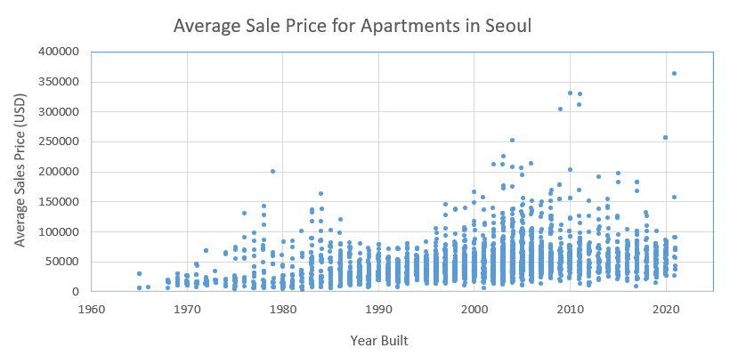

# Spreadsheet Analysis

## Data Set Details

The data set I have chosen is focused on real estate prices for apartments in Seoul, South Korea. The data set is from Kaggle (https://www.kaggle.com/jcy1996/seoul-real-estate-datasets) and it was originally in CSV format. I saved the original CSV file as a plain text (.txt) file per the instructions. The prices were already converted to USD.

The original file included columns for the following data:
* id : Primary key for a specific apartment
* lat: Latitude
* lng: Longitude
* households: Number of households in residence
* buildDate: Date the apartment was built
* score: Total evaluation, maximum 5 stars
* m2: The area of a house(m^2)
* p: Number of floors
* minsales, maxsales, avg_sales: Descriptive statistics of sales price

Here are the first 20 rows of the raw data:
| id    | lat         | lng         | households | buildDate | score | m2  | p  | min_sales | max_sales | avg_sales |
|-------|-------------|-------------|------------|-----------|-------|-----|----|-----------|-----------|-----------|
| 2766  | 37.68160372 | 127.0565917 | 492        | 200006    | 4.3   | 139 | 42 | 60100     | 62000     | 61000     |
| 5860  | 37.6792898  | 127.0570207 | 468        | 200105    | 4.1   | 105 | 32 | 48600     | 52200     | 51000     |
| 15564 | 37.67688187 | 127.0580753 | 57         | 200502    | 4.8   | 86  | 26 | 36000     | 46000     | 40500     |
| 3700  | 37.67527716 | 127.0600011 | 216        | 199509    | 4.8   | 102 | 31 | 34000     | 34800     | 34500     |
| 6204  | 37.67638079 | 127.0583606 | 165        | 200306    | 4.8   | 91  | 28 | 27900     | 50300     | 40000     |
| 3697  | 37.67735438 | 127.0572686 | 299        | 200004    | 4.4   | 84  | 25 | 29200     | 39000     | 34500     |
| 19203 | 37.67659042 | 127.0571138 | 45         | 200905    | 4     | 126 | 38 | 36500     | 64600     | 63000     |
| 3699  | 37.67383553 | 127.0601315 | 290        | 199704    | 3.9   | 84  | 25 | 24300     | 40400     | 31000     |
| 948   | 37.68109689 | 127.0537572 | 1391       | 199811    | 4     | 54  | 16 | 17100     | 26600     | 23500     |
| 15206 | 37.67996178 | 127.053507  | 1313       | 199810    | 4     | 53  | 16 | 15800     | 26000     | 22500     |
| 19851 | 37.6860596  | 127.053443  | 548        | 200911    | 3.8   | 79  | 24 | 36900     | 41200     | 40000     |
| 10023 | 37.67461549 | 127.0570851 | 100        | 200411    | 4.5   | 90  | 27 | 34000     | 46800     | 44500     |
| 19850 | 37.68747591 | 127.0535532 | 696        | 200911    | 3.6   | 110 | 33 | 38700     | 40200     | 39500     |
| 3702  | 37.67298548 | 127.0592013 | 397        | 199510    | 4.1   | 102 | 31 | 30700     | 31100     | 31000     |
| 6705  | 37.67458711 | 127.0561375 | 175        | 200411    | 4.8   | 103 | 31 | 42500     | 45000     | 43000     |
| 2808  | 37.67738514 | 127.0531469 | 763        | 199410    | 3.7   | 59  | 18 | 13800     | 41500     | 30000     |
| 19849 | 37.69001654 | 127.0538271 | 473        | 200908    | 4.4   | 75  | 23 | 24100     | 39100     | 28500     |
| 21230 | 37.68437059 | 127.0507213 | 139        | 200212    | 3.4   | 109 | 33 | 33500     | 34400     | 34000     |
| 19848 | 37.68969289 | 127.0522714 | 680        | 200908    | 4     | 78  | 24 | 24300     | 40900     | 29500     |

## Data Munging

I used Pandas dataframes to clean the data. The first step I took was to remove the columns I was not going to work with. These columns were lat, lng, households, score and p. I used Pandas dataframe to include only the columns I needed.

```
df = df[['id', 'buildDate', 'm2', 'min_sales', 'max_sales', 'avg_sales']]
```

The second step I took was removing NaN values. Although not shown in the first 20 rows, there were a lot of NaN values for min_sales, max_sales and avg_price. I used the Pandas dropna() function to solve this.

```
df = df.dropna()
```

## Data Analysis

I created an Excel file called 'imported_clean_data.xlsx' in the main folder, importing data from 'clean_data.csv' located in the 'data' folder.

My aggregate statistics and chart are in 'imported_clean_data.xlsx'.

The simple aggregate statistics I calculated are:
* Average Sales Price: The average sales price for apartment housing, which was $46,565. 
* Max. Sales Price: The highest sales price for apartment housing, which was $637,700. 
* Min. Sales Price: The lowest sales price for apartment housing, which was $1,100.
* Mean m2: The average square meter for apartment housing, which was 84.
* Oldest Build Date: To see where the beginning year of the data, which was June of 1965.
* Newest Build Date: To see where the most recent year of the data, which was May of 2021.

Apartments count for the majority of housing in Seoul. According to The Korea Herald, apartments account for 59% of all homes in South Korea (2018). I assume this percentage is even higher in Seoul, which is densely filled with many apartment complexes. What I noticed from looking at the data is that first off, there is not much deviation in the square meter, because of how apartments are designed. What suprised me however was that for the highest sales price in this dataset ($637,700), the square meter for that unit was 87 m2, around the average square meter.

This may not be related to the assignment, but this caught my interest so I looked into it. I searched up this particular apartment and recognized it. Back when I was living in Seoul, I remember there was news of G-Dragon (K-pop celebrity) buying the most expensive penthouse unit at this apartment complex. I am guessing that was his purchase.

Moving forward, I then calculated conditional aggregate statistics for:
* Average Sales Price based on Build Date
  * 1965 - 1980: $27,504
  * 1980 - 1990: $33,202	
  * 1990 - 2000: $39,939
  * 2000 - 2010: $50,935
  * 2010 - 2020: $59,814
  * 2020 - 2021: $66,385

and
* Max. Sales Price based on Build Date 
  * 1965 - 1980: $243,000
  * 1980 - 1990: $222,500
  * 1990 - 2000: $199,000
  * 2000 - 2010: $550,000
  * 2010 - 2020: $637,700
  * 2020 - 2021: $620,000

From the data, we can observe that Seoul apartment housing prices have been increasing drastically over the decades. The average price currently is double that of the average price in 1980 - 1990. I have also created a chart shown below that shows the increase in price.



The chart shows the steady increase in apartment prices. In the 1980s, there is some deviation and spread, which decreases in the 1990s, where the prices are densely populated around $50,000. Then in the 2000s, we can see the dense area increasing upwards and more high-priced spread again. These high-priced points clearly show the emergence of new high-price luxury apartments being built, notably in the last two decades.
